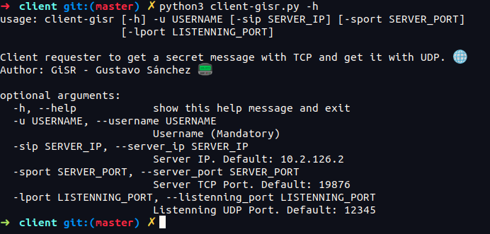
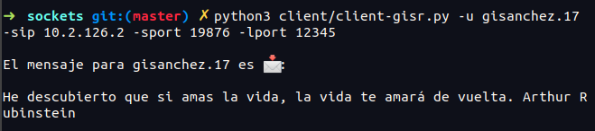
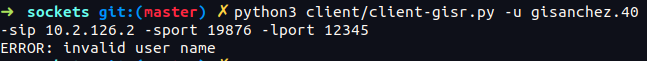
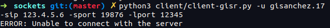
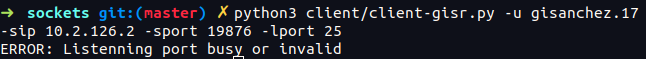

# Cliente TCP/UDP de Servidor Getmymsg 🌐

Practica #3 de la catedra _Sistemas Distribuidos_ de la _Universidad Católica Andrés Bello de Caracas_.

Prof. Rómulo Rodríguez

## Requisitos 👀

- Python 3.6.9 🐍

## Uso 📕

```bash
python3 client/client-gisr.py -u USERNAME -sip SERVER_IP -sport SERVER_PORT -lport LISTENNING_PORT
```

> NOTA: El usuario es un parámetro obligatorio

Para observar la lista de parámetros y sus valores por defecto

```bash
python3 client/client-gisr.py -h
```

<p align="center">
  
</p>

### Ejemplo

A continuacion un ejemplo de uso

```bash
python3 client/client-gisr.py -u gisanchez.17 -sip 10.2.126.2 -sport 19876 -lport 12345
```

<p align="center">
  
</p>

## Manejo de errores ⚠

Aquí se muestran algunos errores manejados para que el cliente entienda la razón de su no obtención del mensaje

<p align="center">
  
</p>

<p align="center">
  
</p>

<p align="center">
  
</p>

## Autor / Alumno

GiSR - Gustavo Sánchez


